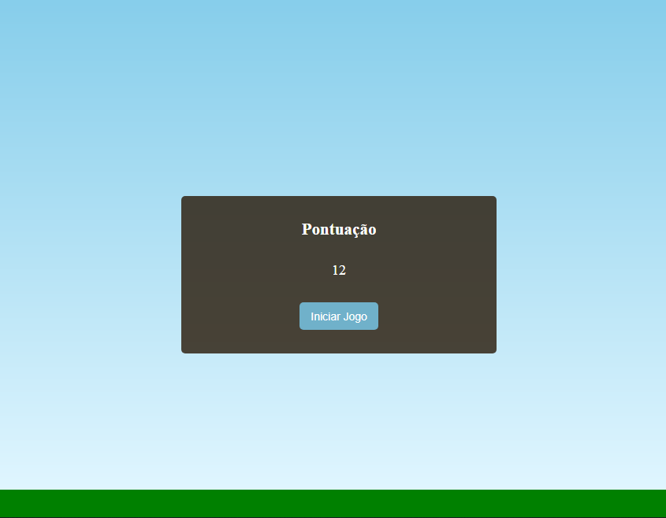

<h1>Jogo Mário Jump</h1>

  
 <!-- <a href="#visao">• Visão geral</a>   -->
 <a href="#leng">• Skills utilizadas</a>
  
 <a href="#contato">• Contato</a>

 

<h1>Visão geral</h1>
Esta aplicação é de um <strong>Jogo de Mário</strong>, aonde ele está corendo em uma superfície plna e precisa se desviar dos obstáculos que vêm na sua direção. Se ele tocar no obstáculo o jogo termina e é mostrado o placar conseguido
 
 

<h1 align="center">
<!-- <h1> -->
<a href="https://mario-jump-game.netlify.app/" target="_blank">Testar</a> 
</h1>

  

 
 

<h1>Skills utilizadas</h1>

 
  
  
      

 
 
 

<h1>Como entro em contato?</h1>

Entre em contato através dos links a seguir!
 
 

 
 
 
